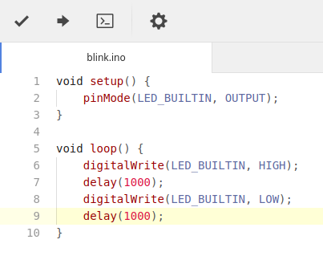

# Arduino Upload Package

## Add a toolbar

You can install `tool-bar` and `flex-tool-bar` Atom packages and use them to add a toolbar for Arduino commands, similar to the one in the official IDE.

	apm install tool-bar
	apm install flex-tool-bar

The following is an example for the Flex Tool Bar's default configuration file, `toolbar.cson`. It adds the buttons for Arduino **Verify** and **Upload** commands and another to open the **Serial Monitor**.

Please note that Flex Tool Bar can use many different configuration files and each different type of configuration file has it's own formatting and syntax rules.

```coffeescript
[
	{
		type: "button"
		icon: "check"
		callback: ["arduino-upload:verify"]
		tooltip: "Arduino: Verify"
		enable: { grammar: "arduino" }
	}
	{
		type: "button"
		icon: "arrow-right"
		callback: ["arduino-upload:upload"]
		tooltip: "Arduino: Upload"
		enable: { grammar: "arduino" }
	}
	{
		type: "button"
		icon: "terminal"
		callback: "arduino-upload:serial-monitor"
		tooltip: "Arduino: Serial Monitor"
		enable: { grammar: "arduino" }
	}
	{
		type: "spacer"
	}
	{
		type: "button"
		icon: "gear"
		callback: "flex-tool-bar:edit-config-file"
		tooltip: "Edit Tool Bar"
	}
]
```

Here's the result:


